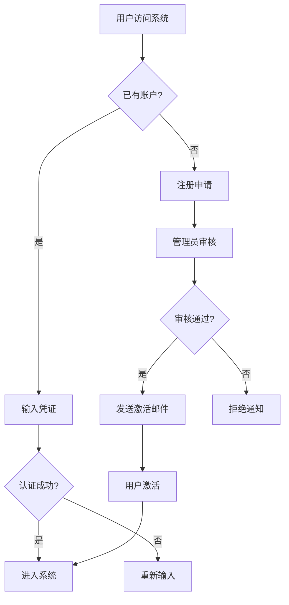
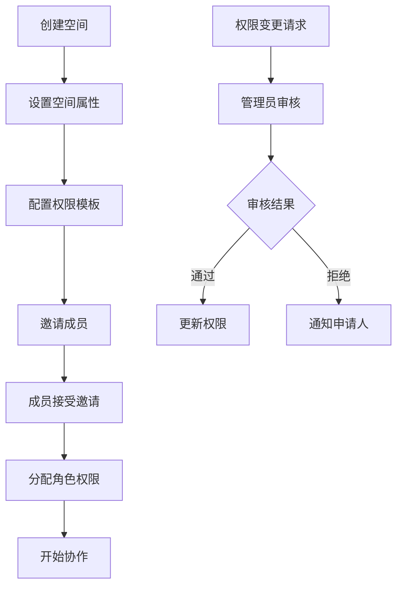
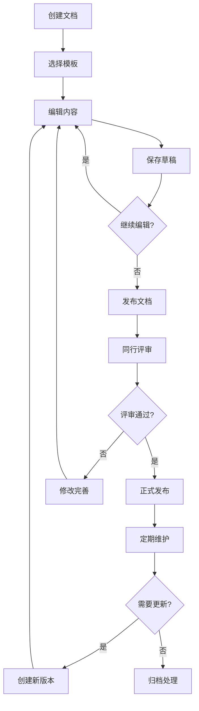
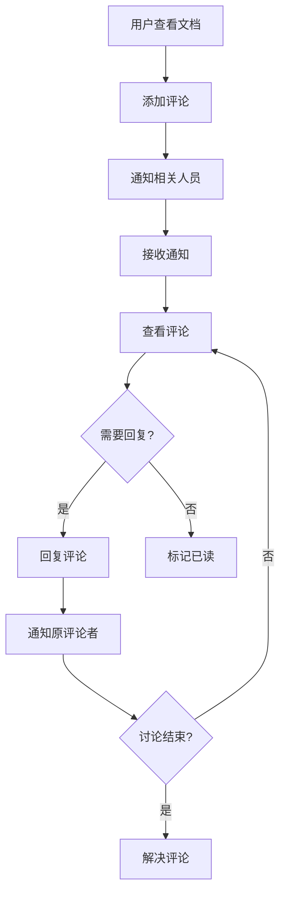

# KMS-Wind 业务需求和流程设计文档

## 1. 项目概述

### 1.1 项目背景
随着企业数字化转型的深入推进，企业内部知识管理和协作需求日益增长。传统的文档管理方式存在以下问题：
- 知识分散存储，难以有效检索和复用
- 协作效率低下，缺乏实时编辑和评论功能
- 权限管理复杂，安全性难以保障
- 版本控制混乱，历史变更难以追溯

### 1.2 项目目标
基于 Atlassian Confluence 的成功模式，构建一个企业级知识管理系统（KMS-Wind），实现：
- **知识集中化管理**: 统一的知识库平台，支持结构化文档组织
- **高效协作**: 实时编辑、评论、讨论等协作功能
- **智能搜索**: 全文检索和智能推荐
- **安全可控**: 细粒度权限控制和审计追踪
- **企业级扩展**: 支持大规模用户和海量文档

### 1.3 成功标准
- **用户采用率**: 90%以上的目标用户活跃使用
- **响应性能**: 页面加载时间 < 2秒
- **系统可用性**: 99.9%的服务可用性
- **用户满意度**: NPS评分 > 8.0
- **投资回报**: 12个月内实现正向ROI

## 2. 目标用户分析

### 2.1 用户角色定义

#### 2.1.1 系统管理员
- **职责**: 系统配置、用户管理、安全策略制定
- **需求**: 全局控制能力、详细的审计日志、系统监控
- **典型场景**: 配置企业SSO、管理用户权限、监控系统性能

#### 2.1.2 空间管理员
- **职责**: 工作空间管理、团队权限分配、内容治理
- **需求**: 空间配置能力、成员管理、内容审核
- **典型场景**: 创建项目空间、邀请团队成员、设置内容规范

#### 2.1.3 内容创作者
- **职责**: 文档创建、知识沉淀、经验分享
- **需求**: 便捷的编辑工具、模板支持、版本管理
- **典型场景**: 编写技术文档、创建培训材料、分享最佳实践

#### 2.1.4 知识消费者
- **职责**: 查找信息、学习知识、参与讨论
- **需求**: 快速检索、清晰导航、移动端支持
- **典型场景**: 查找API文档、学习业务流程、参与技术讨论

#### 2.1.5 外部合作伙伴
- **职责**: 有限访问、项目协作、信息共享
- **需求**: 安全访问、特定权限、简化操作
- **典型场景**: 查看项目进度、下载交付物、提供反馈

### 2.2 用户画像

#### 2.2.1 技术团队用户
- **特征**: 熟悉开发工具、偏好Markdown、重视版本控制
- **需求**: 代码片段支持、API文档模板、与开发工具集成

#### 2.2.2 业务团队用户
- **特征**: 重视可视化、偏好所见即所得、注重协作
- **需求**: 丰富的编辑器、图表支持、评论和审批流程

#### 2.2.3 管理团队用户
- **特征**: 关注整体进度、重视数据分析、偏好概览视图
- **需求**: 仪表板、统计报表、关键指标监控

## 3. 核心业务流程

### 3.1 用户注册和认证流程

### 3.2 空间和权限管理流程

### 3.3 文档生命周期管理

### 3.4 协作和评论流程

## 4. 功能需求详细说明

### 4.1 核心功能模块

#### 4.1.1 文档管理功能
**FR-DOC-001: 文档创建和编辑**
- **描述**: 用户可以创建和编辑各种类型的文档
- **前置条件**: 用户已登录并具有相应权限
- **主要流程**:
  1. 选择创建文档的空间和位置
  2. 选择文档模板（可选）
  3. 输入文档标题和内容
  4. 添加标签和元数据
  5. 保存为草稿或直接发布
- **验收标准**:
  - 支持Markdown和富文本编辑
  - 支持实时保存和自动备份
  - 支持插入图片、表格、代码块
  - 支持数学公式和图表

**FR-DOC-002: 文档版本控制**
- **描述**: 系统自动管理文档的版本历史
- **主要功能**:
  - 自动创建版本快照
  - 版本比较和差异显示
  - 版本回滚和恢复
  - 版本标记和说明
- **验收标准**:
  - 每次保存自动创建版本
  - 支持主要版本和次要版本
  - 提供直观的版本比较界面
  - 支持版本分支和合并

**FR-DOC-003: 文档组织和导航**
- **描述**: 支持层次化的文档组织结构
- **主要功能**:
  - 树形文档结构
  - 拖拽重新组织
  - 面包屑导航
  - 文档移动和复制
- **验收标准**:
  - 支持无限层级嵌套
  - 快速定位和导航
  - 批量操作支持
  - 权限继承机制

#### 4.1.2 空间管理功能
**FR-SPACE-001: 工作空间创建**
- **描述**: 支持创建和管理多个工作空间
- **主要功能**:
  - 空间类型选择（团队、项目、个人）
  - 空间配置和定制
  - 主页设置
  - 空间模板
- **验收标准**:
  - 支持多种空间类型
  - 灵活的配置选项
  - 直观的空间管理界面

**FR-SPACE-002: 成员和权限管理**
- **描述**: 精细化的权限控制机制
- **主要功能**:
  - 角色定义和分配
  - 权限矩阵管理
  - 成员邀请和移除
  - 权限继承和覆盖
- **验收标准**:
  - 基于角色的权限控制（RBAC）
  - 支持自定义角色
  - 批量权限操作
  - 权限审计日志

#### 4.1.3 搜索和发现功能
**FR-SEARCH-001: 全文搜索**
- **描述**: 强大的全文搜索功能
- **主要功能**:
  - 关键词搜索
  - 高级搜索筛选
  - 搜索结果排序
  - 搜索建议和补全
- **验收标准**:
  - 毫秒级搜索响应
  - 支持模糊搜索
  - 智能搜索建议
  - 搜索结果高亮

**FR-SEARCH-002: 智能推荐**
- **描述**: 基于用户行为的内容推荐
- **主要功能**:
  - 相关文档推荐
  - 热门内容推荐
  - 个性化推荐
  - 最近访问记录
- **验收标准**:
  - 推荐准确率 > 80%
  - 实时更新推荐内容
  - 可解释的推荐理由

#### 4.1.4 协作功能
**FR-COLLAB-001: 实时编辑**
- **描述**: 支持多人同时编辑文档
- **主要功能**:
  - 冲突检测和解决
  - 编辑者状态显示
  - 实时光标同步
  - 编辑锁定机制
- **验收标准**:
  - 支持10人同时编辑
  - 冲突自动解决
  - 编辑历史记录

**FR-COLLAB-002: 评论和讨论**
- **描述**: 支持文档的评论和讨论功能
- **主要功能**:
  - 行内评论
  - 嵌套回复
  - 评论解决状态
  - @提及功能
- **验收标准**:
  - 实时评论同步
  - 评论邮件通知
  - 评论权限控制

### 4.2 辅助功能模块

#### 4.2.1 模板管理
**FR-TEMPLATE-001: 文档模板**
- **描述**: 提供丰富的文档模板
- **模板类型**:
  - 会议纪要模板
  - 项目计划模板
  - API文档模板
  - 故障处理模板
  - 培训手册模板

#### 4.2.2 通知系统
**FR-NOTIFY-001: 实时通知**
- **描述**: 及时的系统通知机制
- **通知类型**:
  - 文档更新通知
  - 评论回复通知
  - 权限变更通知
  - 系统维护通知

#### 4.2.3 集成接口
**FR-INTEGRATION-001: 第三方集成**
- **描述**: 与企业现有系统集成
- **集成系统**:
  - SSO认证系统
  - LDAP/AD用户目录
  - 项目管理工具（Jira）
  - 代码仓库（Git）
  - 企业邮箱系统

## 5. 非功能性需求

### 5.1 性能需求
- **响应时间**: 页面加载 < 2秒
- **并发用户**: 支持10,000在线用户
- **数据处理**: 支持100GB+文档存储
- **搜索性能**: 搜索结果 < 200ms

### 5.2 可靠性需求
- **系统可用性**: 99.9%
- **数据备份**: 每日自动备份
- **故障恢复**: RTO < 4小时，RPO < 1小时
- **容错能力**: 单点故障不影响服务

### 5.3 安全性需求
- **身份认证**: 支持MFA多因子认证
- **数据加密**: 传输和存储加密
- **访问控制**: 基于角色的权限控制
- **审计日志**: 完整的操作审计

### 5.4 可扩展性需求
- **用户规模**: 支持100,000+用户
- **存储扩展**: 支持PB级数据存储
- **功能扩展**: 插件化架构设计
- **地域扩展**: 支持多地域部署

### 5.5 可用性需求
- **界面友好**: 符合用户体验标准
- **多语言**: 支持中英文界面
- **移动端**: 响应式设计支持
- **无障碍**: 符合WCAG 2.1标准

## 6. 业务规则和约束

### 6.1 内容管理规则
- **文档命名**: 禁止特殊字符，长度限制100字符
- **内容审核**: 敏感内容自动检测和标记
- **版本保留**: 默认保留50个历史版本
- **存储限制**: 单个文档不超过50MB

### 6.2 权限管理规则
- **最小权限**: 默认最小权限原则
- **权限继承**: 子页面继承父页面权限
- **临时权限**: 支持时间限制的临时权限
- **权限审核**: 定期权限审核和清理

### 6.3 安全合规规则
- **数据分类**: 按敏感级别分类管理
- **访问日志**: 所有访问操作记录
- **数据保留**: 遵循数据保留政策
- **隐私保护**: 符合GDPR等法规要求

## 7. 系统集成需求

### 7.1 认证集成
- **SSO集成**: 与企业SSO系统集成
- **LDAP集成**: 用户信息同步
- **OAuth2**: 支持第三方登录
- **API密钥**: 支持API访问认证

### 7.2 数据集成
- **文档导入**: 支持Word、PDF等格式导入
- **数据同步**: 与其他系统数据同步
- **备份集成**: 与企业备份系统集成
- **监控集成**: 与监控系统集成

### 7.3 工作流集成
- **审批流程**: 与OA系统集成
- **项目管理**: 与项目管理工具集成
- **代码关联**: 与代码仓库关联
- **邮件通知**: 与邮件系统集成

## 8. 实施路线图

### 8.1 第一阶段（MVP - 3个月）
**目标**: 基础功能上线，满足核心需求
**功能范围**:
- 用户注册和认证
- 基础文档管理
- 简单的权限控制
- 基础搜索功能

**交付标准**:
- 支持100用户并发
- 基础功能稳定运行
- 用户满意度 > 7.0

### 8.2 第二阶段（增强版 - 6个月）
**目标**: 完善协作功能，提升用户体验
**功能范围**:
- 实时编辑和协作
- 完整的评论系统
- 高级搜索功能
- 模板管理
- 移动端支持

**交付标准**:
- 支持1000用户并发
- 核心功能完整
- 用户满意度 > 8.0

### 8.3 第三阶段（企业版 - 9个月）
**目标**: 企业级功能，支持大规模部署
**功能范围**:
- 高级权限管理
- 审计和合规功能
- 第三方系统集成
- 高级分析报表
- 插件系统

**交付标准**:
- 支持10000用户并发
- 企业级安全和合规
- 用户满意度 > 8.5

## 9. 风险评估和应对

### 9.1 技术风险
**风险**: 技术架构复杂度高
**应对**: 采用成熟技术栈，分阶段实施

**风险**: 性能瓶颈
**应对**: 性能测试，优化热点

**风险**: 数据安全
**应对**: 多层安全防护，定期安全审计

### 9.2 业务风险
**风险**: 用户采用率低
**应对**: 用户培训，优化用户体验

**风险**: 需求变更频繁
**应对**: 敏捷开发，快速迭代

**风险**: 竞争对手压力
**应对**: 差异化功能，快速响应市场

## 10. 成功指标和KPI

### 10.1 用户指标
- **月活跃用户**: > 80%目标用户
- **用户留存率**: 30天留存 > 70%
- **会话时长**: 平均 > 15分钟
- **功能使用率**: 核心功能 > 60%

### 10.2 内容指标
- **文档创建**: 每月新增文档 > 1000
- **协作参与**: 评论和编辑参与率 > 40%
- **搜索使用**: 搜索成功率 > 85%
- **知识复用**: 文档访问和引用率

### 10.3 技术指标
- **系统可用性**: > 99.9%
- **响应时间**: P95 < 2秒
- **错误率**: < 0.1%
- **安全事件**: 0严重安全事件

### 10.4 业务指标
- **投资回报**: 12个月ROI > 100%
- **运营成本**: 相比现有方案降低30%
- **效率提升**: 文档查找效率提升50%
- **满意度**: NPS > 8.0